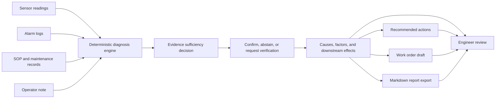

# ForgePulse

ForgePulse is an industry Agent for battery manufacturing equipment diagnosis and maintenance decision support.

🚀 **Online Demo / 在线体验**: [https://wangjiehu.github.io/ForgePulse/](https://wangjiehu.github.io/ForgePulse/)

中文定位：

> ForgePulse 面向新能源电池产线，把传感器时序、报警日志、设备 SOP、维修记录和现场描述整合成可追溯的故障诊断、处置建议、维修工单和复盘报告。

## Why This Matters

Battery coating lines lose margin when equipment abnormalities are detected late or explained without traceable evidence. ForgePulse turns scattered shop-floor signals into a read-only diagnosis workflow that an engineer can audit: every root cause, action, and work-order suggestion links back to alarms, sensor anomalies, SOP sections, or maintenance history.

Verification snapshot:

- `83` backend tests pass.
- `5` golden industrial cases are included, including insufficient and conflicting evidence.
- `71/71` behavioral, integrity, counterfactual, and determinism checks pass.
- Fully offline demo; no model token or production data is required.
- Public sample reports are checked in for review.


## Demo in 3 Minutes

1. Start the backend and frontend from the Quick Start below.
2. Open `http://localhost:5173`.
3. Switch across the five coating-line cases.
4. Compare confirmed, insufficient-evidence, and conflicting-evidence decisions.
5. Click any evidence ID to locate the original evidence.
6. Inspect root causes, contributing factors, downstream effects, actions, and work order.
7. Click `导出报告` or read the checked-in reports:
   - [Dryer and tension report](reports/generated_samples/coating_line_dryer_tension_001.md)
   - [Airflow report](reports/generated_samples/coating_line_airflow_002.md)
   - [Drive resistance report](reports/generated_samples/coating_line_drive_resistance_003.md)
   - [Insufficient evidence report](reports/generated_samples/coating_line_incomplete_evidence_004.md)
   - [Conflicting evidence report](reports/generated_samples/coating_line_conflicting_evidence_005.md)

## Architecture at a Glance



## Quick Start

### Prerequisites

- Python 3.11+
- Node.js 18+ and npm

### Backend

```bash
# From project root
cd app/backend

# Install dependencies
pip install -e ".[dev]"

# Start the API server (open mode — local dev only)
uvicorn forgepulse_api.main:app --reload --port 8000

# Verify
curl http://localhost:8000/health
curl http://localhost:8000/cases
curl http://localhost:8000/cases/coating_line_dryer_tension_001/diagnosis
```

#### Authentication & rate limiting (production)

The API runs in **open mode** (no auth) when `FORGEPULSE_API_KEYS` is unset —
local dev only. For any external exposure, configure API keys:

```bash
# <key>:<role>, role is viewer|engineer|admin
export FORGEPULSE_API_KEYS="alice-key:admin,bob-key:viewer"
export FORGEPULSE_RATE_LIMIT=60   # per key per minute

# Authenticated requests use the X-API-Key header
curl -H "X-API-Key: bob-key" http://localhost:8000/cases
```

Every request is audit-logged to `logs/audit.jsonl`. See
`docs/SECURITY_AND_SAFETY_BOUNDARIES.md`.

#### LLM advisory review (optional)

The diagnosis engine is deterministic by default. To enable the advisory LLM
review layer (OpenAI-compatible endpoint), set:

```bash
export FORGEPULSE_MODEL_PROVIDER=openai_compatible
export FORGEPULSE_MODEL_BASE_URL=http://localhost:8001/v1
export FORGEPULSE_MODEL_API_KEY=...
export FORGEPULSE_MODEL_NAME=...

# Then request reasoning (or rely on ?reasoning=auto)
curl -H "X-API-Key: bob-key" \
  "http://localhost:8000/cases/coating_line_dryer_tension_001/diagnosis?reasoning=llm"

# Verify the live LLM path end-to-end
python scripts/verify_agent.py
```

The LLM only reviews; it never overrides the structured diagnosis. See
`docs/AGENT_WORKFLOW.md`.

### Frontend

```bash
# From project root
cd app/frontend

# Optional: override backend API URL
copy .env.example .env

# Install dependencies
npm install

# Start dev server
npm run dev

# Open http://localhost:5173
```

### Run Tests

```bash
cd app/backend
pytest -v
```

### Run Evaluation

```bash
cd project_root
python3 evaluation/evaluate_cases.py
```

### One-command Verification on Windows

```powershell
.\scripts\verify.ps1
```

### Start and Stop the Demo on Windows

```powershell
.\scripts\run_demo.ps1
.\scripts\stop_demo.ps1
```

### Validate or Import a Historical Case

```powershell
conda run -n happy python scripts\case_cli.py validate C:\path\to\case
conda run -n happy python scripts\case_cli.py import C:\path\to\case
conda run -n happy python scripts\case_cli.py diagnose your_case_id --report reports\your_case.md
```

### Generate Sample Reports

```bash
cd project_root
python scripts/generate_sample_reports.py
```

## API Endpoints

| Endpoint | Method | Description |
|---|---|---|
| `/health` | GET | Health check (open; returns provider mode, case count, rate limit) |
| `/cases` | GET | List available cases with metadata |
| `/cases/{case_id}/diagnosis` | GET | Get structured diagnosis JSON. `?reasoning=auto\|off\|llm` controls the advisory LLM review layer |
| `/cases/{case_id}/report` | GET | Export diagnosis as Markdown report |
| `/cases/{case_id}/validation` | GET | Return case validation errors and warnings |
| `/cases/{case_id}/narrative` | GET | Optional narrative-only model enhancement |
| `/fault-modes` | GET | List fault mode definitions |

All endpoints except `/health` require an `X-API-Key` header when
`FORGEPULSE_API_KEYS` is configured (production). Rate-limited per key.

## Available Cases

| Case ID | Title | Key Faults |
|---|---|---|
| `coating_line_dryer_tension_001` | Dryer zone 2 temperature control loop instability | DRY-122, TEN-204, QCS-318 |
| `coating_line_airflow_002` | Fan inverter airflow frequency instability | AIR-305, DRY-122, QCS-318 |
| `coating_line_drive_resistance_003` | Drive current resistance from roller surface contamination | DRV-410, TEN-204, QCS-318 |
| `coating_line_incomplete_evidence_004` | Missing dryer temperature evidence | Must abstain and request data |
| `coating_line_conflicting_evidence_005` | Dryer alarm conflicts with fan sensor evidence | Must request verification |

## Diagnosis Output

The diagnosis JSON includes:

- **incident_summary**: High-level description of the incident
- **diagnostic_process**: Step-by-step process trace with timing
- **data_quality**: Data completeness and warning report
- **timeline**: Chronological events with severity and evidence links
- **evidence**: All referenced evidence with source, timestamp, field, value
- **root_cause_candidates**: Ranked root causes with confidence, priority, score breakdown, and fault mode IDs
- **diagnosis_status**: confirmed, provisional, insufficient evidence, or conflicting evidence
- **primary_root_cause / contributing_factors / downstream_effects**: Explicit causal roles
- **missing_evidence / conflicting_evidence**: Reasons the Agent cannot safely confirm a diagnosis
- **evidence_links**: Directed graph connecting root causes → evidence → sources
- **recommended_actions**: Actionable steps linked to root causes, with role assignments
- **work_order_draft**: Pre-filled maintenance work order
- **value_estimates**: Conservative business value projections
- **postmortem_summary**: Post-incident analysis
- **limitations**: Uncertainty and disclaimer notes

All evidence IDs in causes, actions, timeline, and evidence graph refer to real sample inputs. Evaluation fails on broken references, non-deterministic output, golden-label dependency, or incorrect counterfactual behavior.

## Score Breakdown

Each root cause candidate includes a score breakdown following the AGENT_WORKFLOW formula:

| Factor | Weight | Description |
|---|---|---|
| alarm_match | 0.30 | Fraction of fault mode alarm codes present |
| sensor_correlation | 0.25 | Fraction of fault mode sensor fields with anomalies |
| sop_match | 0.20 | Whether SOP provides relevant procedures |
| maintenance_similarity | 0.15 | Whether historical maintenance records show similar patterns |
| operator_note_match | 0.10 | Whether operator note keywords match fault mode symptoms |

## Offline Demo

ForgePulse works fully offline without any model API keys. A bounded `DiagnosisAgent` uses:

- Threshold-based anomaly detection on sensor data
- Sustained drift detection (upward/downward)
- Structured alarm parsing
- Keyword-based SOP and maintenance record retrieval
- Fault mode library matching with weighted scoring
- Evidence chain construction with source traceability
- Evidence sufficiency and conflict decisions
- Dynamic stop, continue, or verify branches

An optional compatible provider may improve summary wording only. It cannot change diagnosis facts, and any unknown Evidence ID causes the enhancement to be rejected.

## Project Structure

```text
ForgePulse/
  app/
    backend/           # FastAPI backend
      forgepulse_api/
        main.py        # API endpoints
        schemas.py     # Pydantic models
        services/
          case_loader.py      # Load & validate case data
          sensor_analyzer.py  # Threshold & drift detection
          alarm_parser.py     # Parse alarm CSV
          retriever.py        # SOP & maintenance retrieval
          diagnosis.py        # Fault-mode-matched diagnosis engine
          report_writer.py    # Render Markdown report
      tests/
    frontend/          # React + Vite frontend
      src/
        App.tsx        # Engineer workbench UI
        styles.css     # Workspace styling
  data/
    samples/           # Sample case data
      coating_line_case/    # Case 1: dryer & tension
      airflow_case/         # Case 2: fan & airflow
      drive_resistance_case/ # Case 3: drive & resistance
      incomplete_evidence_case/ # Case 4: abstention
      conflicting_evidence_case/ # Case 5: verification required
    fault_modes.json   # Fault mode definitions
  evaluation/
    golden_cases.json  # Golden case expectations
    evaluate_cases.py  # Evaluation runner
  reports/
    generated_samples/ # Checked-in Markdown report exports
  docs/                # Architecture, workflow, evaluation docs
  schemas/             # JSON schemas
```

## Key Documents

- [PLANNING.md](PLANNING.md): Project planning
- [DELIVERY_CHECKLIST.md](DELIVERY_CHECKLIST.md): Delivery checklist
- [docs/DECISION_REVIEW.md](docs/DECISION_REVIEW.md): Direction review
- [docs/AI_BUILD_PROTOCOL.md](docs/AI_BUILD_PROTOCOL.md): AI build protocol
- [docs/SYSTEM_ARCHITECTURE.md](docs/SYSTEM_ARCHITECTURE.md): System architecture
- [docs/AGENT_WORKFLOW.md](docs/AGENT_WORKFLOW.md): Agent workflow
- [docs/DATA_CONTRACTS.md](docs/DATA_CONTRACTS.md): Data contracts
- [docs/EVALUATION_PLAN.md](docs/EVALUATION_PLAN.md): Evaluation plan
- [docs/IMPLEMENTATION_GUIDE.md](docs/IMPLEMENTATION_GUIDE.md): Implementation guide
- [docs/BUSINESS_VALUE.md](docs/BUSINESS_VALUE.md): Business value and target customer
- [docs/PILOT_DEPLOYMENT_PLAN.md](docs/PILOT_DEPLOYMENT_PLAN.md): Factory pilot deployment plan
- [docs/SECURITY_AND_SAFETY_BOUNDARIES.md](docs/SECURITY_AND_SAFETY_BOUNDARIES.md): Safety and security boundaries
- [docs/PITCH_SCRIPT.md](docs/PITCH_SCRIPT.md): 30-second and 5-minute pitch script
- [docs/DEMO_VIDEO_SCRIPT.md](docs/DEMO_VIDEO_SCRIPT.md): 90-second demo video script
- [docs/PUBLIC_RELEASE_CHECKLIST.md](docs/PUBLIC_RELEASE_CHECKLIST.md): Public repository release checklist
- [docs/NEXT_STRATEGIC_WORK_PLAN.md](docs/NEXT_STRATEGIC_WORK_PLAN.md): Prioritized next work after the current baseline
- [docs/POST_EXECUTION_REVIEW.md](docs/POST_EXECUTION_REVIEW.md): Final implementation review and external gaps
- [docs/AI_BUILD_LOG.md](docs/AI_BUILD_LOG.md): Reproducible AI-assisted engineering record
- [deliverables/ForgePulse-Agent-Hackathon.pptx](deliverables/ForgePulse-Agent-Hackathon.pptx): Editable 9-slide pitch deck

## Non-goals

- Not a generic chat assistant
- Not a marketing landing page
- Does not replace on-site safety responsibility
- Does not use real sensitive production data in public demos
- NPU deployment is not required for the first version
