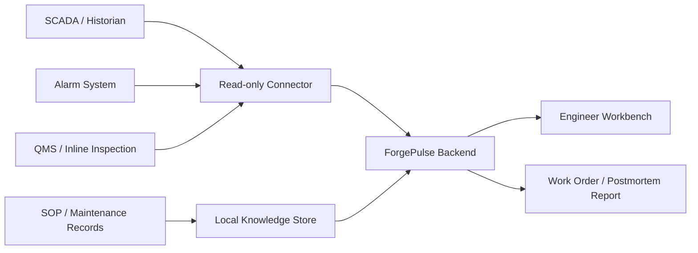

# Pilot Deployment Plan

ForgePulse 的市场化目标是先成为 **厂内试点级诊断助手**，而不是直接进入生产控制闭环。

## Pilot Objective

在 4-8 周内验证：

- 能否减少工程师拼接证据的时间。
- 能否稳定生成可追溯诊断报告。
- 能否辅助新人完成标准排查流程。
- 能否帮助质量团队更快定位受影响物料窗口。

## Deployment Principle

第一阶段只读，不控制。

ForgePulse 只读取数据，不写回设备，不下发控制指令，不绕过安全流程。

## Data Sources

### Required for first pilot

- Sensor time series:
  - dryer temperature
  - web tension
  - line speed
  - fan frequency
  - drive current
  - thickness inspection
- Alarm logs:
  - timestamp
  - alarm code
  - severity
  - message
  - status
- SOP / manuals:
  - alarm explanation
  - standard checks
  - safety notes
- Maintenance records:
  - symptom
  - resolution
  - downtime
  - lessons learned

### Optional later

- MES work orders.
- Spare-part records.
- Shift handover notes.
- Quality hold/release decisions.

## Pilot Architecture

### Option A: Offline demo / internal evaluation

- Synthetic or exported sample data.
- Local backend and frontend.
- No model token required.
- Best for first technical review.

### Option B: Plant internal read-only pilot

- Backend deployed on factory internal server.
- Data is exported periodically or read from replicas.
- No internet dependency.
- Reports reviewed by engineers before action.

### Option C: Edge / Ascend route

- Backend and model gateway deployed near production line.
- NPU used for local model inference or batch summarization.
- Sensitive production data stays inside factory network.

## Roles

| Role | Use Case |
|---|---|
| Equipment engineer | Root-cause diagnosis and maintenance work order |
| Quality engineer | Affected material window and quality risk |
| Production supervisor | Downtime impact and recovery status |
| Safety reviewer | Confirm safety boundary and intervention steps |

## Pilot Success Metrics

| Metric | Measurement |
|---|---|
| Initial diagnosis time | Time from alarm window selection to first structured diagnosis |
| Evidence completeness | Percentage of root-cause candidates with valid evidence |
| Report generation time | Time to produce postmortem draft |
| Engineer acceptance | Percentage of reports accepted after review |
| Knowledge reuse | Similar maintenance records correctly retrieved |

## Deployment Steps

1. Select one production line and 2-3 historical incidents.
2. Export read-only data into ForgePulse case format.
3. Validate schema and evidence mapping.
4. Run deterministic diagnosis.
5. Compare results with historical engineering conclusions.
6. Tune fault mode definitions and thresholds.
7. Run a two-week shadow pilot.
8. Review value metrics and safety feedback.

## Expert Review Protocol

真实专家盲审需要外部设备或质量工程师参与，当前仓库不伪造该结果。建议试点时使用以下 1-5 分量表：

- 根因合理性。
- 证据完整性。
- 动作可执行性。
- 不确定性表达是否恰当。
- 是否愿意在影子试点中使用。

盲审材料不显示 golden expectation；专家先独立判断，再与 ForgePulse 输出比较。

## Risk Controls

- Reports are advisory.
- Engineer approval required before physical action.
- Safety notes are always shown.
- Unknown or insufficient evidence must be reported as uncertainty.
- No customer data should be included in public demos.
